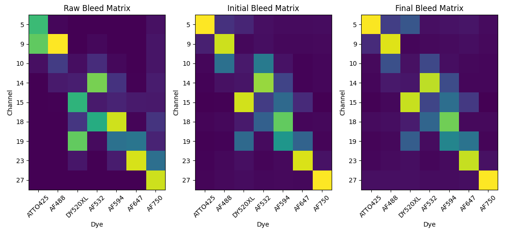

The coppafish pipeline is separated into distinct sections. Some of these are for image pre-processing
([extract](#extract), [filter](#filter)), image alignment ([register](#register), [stitch](#stitch)) and spot
detection/gene calling ([find spots](#find-spots), [call spots](#call-spots),
[orthogonal matching pursuit](#orthogonal-matching-pursuit)). Below, each stage is given in chronological order. For
full detail on each pipeline section, click on a stage on the left panel.

## Extract

All raw data is re-saved at the `tile_dir` in the `file_names` config section. Coppafish does this to:

* compress data.
* remove unused tiles, rounds, and channels that may be in the given raw files.
* save the raw data in a consistent format.
* allow for faster data reading by using [zarr](https://zarr.readthedocs.io/) arrays.

Extract also saves metadata inside of the `tile_dir` directory if the raw files are ND2 format.

## Filter

Extract images are then filtered to minimise scattering of light/de-blur (bright points will appear as cones initially,
hence the name "Point Spread Function") and emphasise spots. A given point spread function is used to Wiener deconvolve
the images.

After filtering is applied, the images are saved to the notebook as `float16` compressed zarr arrays.

## Find spots

Point clouds (a series of spot x, y, and z locations) are generated for each filtered image. These are found by
detecting local maxima in image intensity around the rough spot size (specified by config variables `radius_xy` and
`radius_z` in the `find_spots` section). If two local maxima are the same value and in the same spot region, then one
is chosen at random. Warnings and errors are raised if there are too few spots detected in a round/channel, these can
be customised, see `find_spots` section in the
<a href="https://github.com/paulshuker/coppafish/blob/HEAD/coppafish/setup/settings.default.ini" target="_blank">
config</a> default file for variable names.

## Register

## Stitch

## Call spots

Ideally, every dye would express itself in a single, unique channel. In reality, dyes can express themselves in many
channels, including the same channels as other dyes. A preliminary guess of the dye expression is used, but call spots
improves these initial guesses by using high quality spots found in [find spots](#find-spots) in the anchor
round/channel.

<figure markdown="span">
  { width="800" }
  <figcaption>The bleed matrix throughout call spots, moving from left to right.</figcaption>
</figure>

We also expect different genes to vary in brightness across both rounds and channels. Two reasons are:

* Bridge probes attach to gene spots where an RCP has been produced. The concentration of bridge probes that attach
(and hence the brightness of the dye that attaches) can vary.
* Microscope software can automatically adjust exposure or expand the data to fill the uint16 range for each
round/channel image separately. This equates to an unknown scale factor for each tile/round/channel that must be found.

Therefore, call spots learns scale factors for each tile, round, and channel image as well as updating the gene bled
codes for each round and channel.

## Orthogonal Matching Pursuit

Orthogonal Matching Pursuit (OMP) is the most sophisticated gene calling method used by coppafish, allowing for
overlapping genes to be detected. It is an iterative,
<a href="https://en.wikipedia.org/wiki/Greedy_algorithm" target="_blank">greedy algorithm</a> that runs on individual
pixels of the images. At each OMP iteration, a new gene is assigned to the pixel. OMP is also self-correcting.
"Orthogonal" refers to how OMP will re-compute every gene contribution (their pixel score) after each iteration by least
squares. Background genes[^1] are considered valid genes in OMP. The iterations stop if:

* iteration number `max_genes` in the `omp` config section is reached.
* assigning the next best gene to the pixel does not have a score above `dot_product_threshold` in the `omp` config.
* the next best gene is a background gene or already assigned to the pixel.
* its residual colour is too dim.

Pixel spot scores are computed by a convolution of the pixel score image with a mean spot. The mean spot is specified by
`mean_spot_filepath` as a .npy file. If it is not specified, a default mean spot is used, shown
[here](omp.md#4-spot-scoring-and-spot-detection). This gives every gene a score image for every pixel. The final OMP
spots are then taken as local maxima on the pixel score image greater than `score_threshold`.
